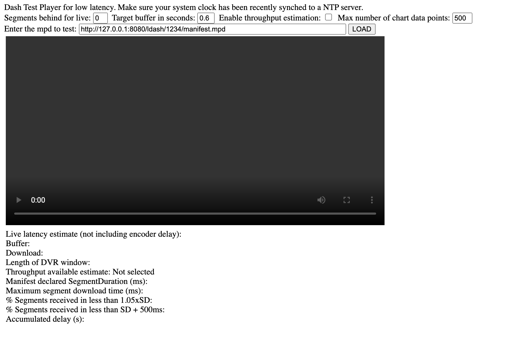
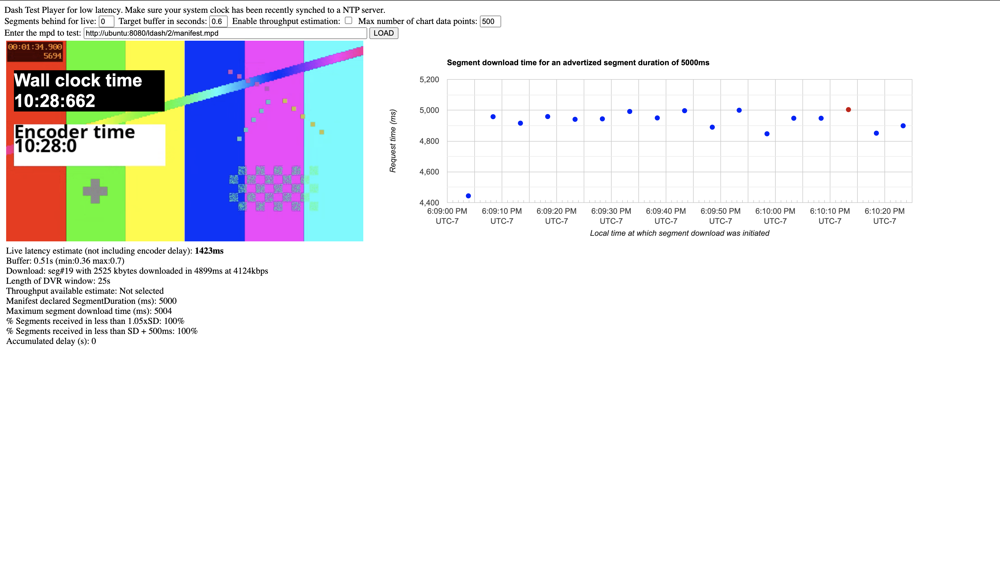

# Low Latency Dash Streaming

Instructions on how to run the low latency dash (LL-DASH) demos.

## Description

This tutorial shows the capabilities of the LL-DASH support feature written to Shaka Packager.

## Environment Setup

Make sure that your Shaka Packager is up-to-date with the low latency feature branch. 

To install the current iteration of Shaka Packager, run the following from the main directory:

```
./buildShakaPackager.sh
```

This script will remove the previous Shaka Packager and install the version containing LL-DASH and ARM support. 

## Running the Demo

To run the LL-DASH demo, there are three components: server, source, and player. For the following, run each command from the `ull-ecosystem/demos/` directory.

```
cd demos
```

### Server
The server supports low latency streaming by holding open file connections. The server will run locally on port 8080.

```
cd server
```

```
./launchLocalUllServer.sh
```

To kill the server, run:
```
./killLocalUllServer.sh 
```

### Shaka Packager Script
The test script will generate a test pattern using FFMPEG and will pipe the stream to Shaka Packager. Shaka Packager, which has the `-is_low_latency_dash` flag enabled, will stream the content using LL-DASH mode to the listening server. 

Please note that the script contains an output directory. The directory default name is '1234'; however, you can edit this as you please. In fact, it is encouraged for you to change the directory before launching a new stream to avoid caching. 

```
cd ffmpeg-to-shaka-packager
```

```
./ullTestPatternWithEncodeTime.sh
```

### Player
The local low latency server also hosts a local DASH.js player to view the stream from. From the browser, hit the following to view the player:

```
http://127.0.0.1:8080/ldashplay/1234/manifest.mpd
```

```
http://{IP_ADDRESS}:{PORT}/ldashplay/{OUTPUT_DIR}/manifest.mpd
```

You can also change IP to hit the stream from a different machine.

The waiting player will look like:



Click the 'load' button to load the manifest, and you are all set!



If you wish to use a different player, use the following URL to access the manifest:
```
http://127.0.0.1:8080/ldash/1234/manifest.mpd
```

```
http://{IP_ADDRESS}:{PORT}/ldash/{OUTPUT_DIR}/manifest.mpd
```